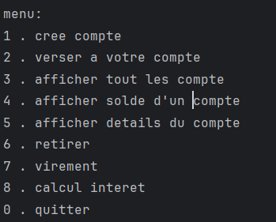
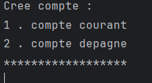

# Banking System – Java Console Application

## 📌 Description
Ce projet est une application console en **Java** qui permet de gérer des comptes bancaires.  
L’application offre des fonctionnalités comme :
- Création de comptes (Courant, Épargne).
- Gestion des transactions (versements, retraits).
- Affichage des détails des comptes et opérations.

---

## ⚙️ Fonctionnalités principales
- **CompteCourant** : avec un découvert autorisé.
- **CompteDepagne** : avec un taux d’intérêt.
- **Operations** : suivre dépôts et retraits.
- **Menu interactif** via `Scanner`.

---

## 🛠️ Technologies utilisées
- **Java (JDK 8)**
- **Programmation orientée objet (POO)**
- **Collections (ArrayList)**

---
---
## 📂 Class Overview
- **Compte (Abstract class)**
  - Attribute : competeur , code , solde , listOperation
  - Abstract method : retirer(),afficherDetails(),versement(),virement(),calculerInteret()
- **CompteCourant (Inherits Compte)**
  - Extra attribute : decouvert
- **CompteDepagne (Inherits Compte)**
  - Extra attribue : tauxIntert
- **Operation (Abstract class)**
  - Attribute: numero , date , montant
- **Retrait (Inherits Operation)**
  - Extra Attribute : destination
- **Versement (Inherits Operation)**
  - Extra Attribute : source-
---
## ✅ Prerequisites
Before running the project, make sure you have:

- Java 8 or higher installed
- A terminal/command line interface
- (Optional) IntelliJ IDEA or Eclipse for development
---
## ✨ Astuce
for double value use , not . 
- Exemple : 3,02 not 3.02
---
## 🖼 Screenshots

etc ...
